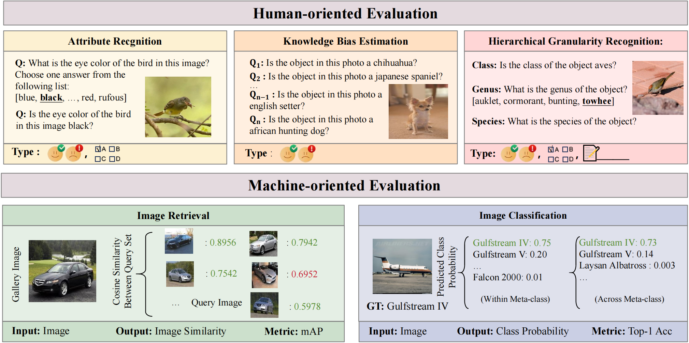

# FG-BMK
This repo contains the data and evaluation code for the paper "Benchmarking Large Vision-Language Models on Fine-Grained Image Tasks: A Comprehensive Evaluation".

## 🔔News

- **🔥[2025-02-06]: We have released our FG-BMK benchmark!**

## Introduction

### FG-BMK

FG-BMK is a comprehensive fine-grained evaluation benchmark, which includes **3.49 million questions** and **3.32 million images**, providing a robust test bed for evaluating LVLMs. FG-BMK incorporates two evaluation paradigms: human-oriented and machine-oriented. The human-oriented evaluation employs dialogue-like interactions to assess a model’s ability to understand and respond to fine-grained visual queries in a conversational context. The machine-oriented evaluation focuses on two core fine-grained vision tasks—image retrieval and recognition—to directly measure the feature representation capabilities of LVLMs. Compared with existing efforts which primarily focus on fine-grained classification or with limited questions, FG-BMK enable a comprehensive assessment of LVLMs’ fine-grained feature representation and semantic recognition abilities. Our evaluations of eight open-source LVLMs/VLMs uncover key findings regarding the influence of training paradigms, modality alignment, perturbation susceptibility, and fine-grained category reasoning on task performance.




# Evaluation Guidelines

## Dataset Preparing

Before running the inference, you need to download the corresponding datasets. The links to the dataset projects are provided below, and you can download the datasets to any location:

|[FGVC-Aircraft](https://www.robots.ox.ac.uk/~vgg/data/fgvc-aircraft/)|[CUB-200-2011](https://www.vision.caltech.edu/datasets/cub_200_2011/)|[DeepFashion](http://mmlab.ie.cuhk.edu.hk/projects/DeepFashion.html)|
|-------------|---------------|---------------|
|[Oxford 102 Flower](https://www.robots.ox.ac.uk/~vgg/data/flowers/102/)|[Food-101](https://data.vision.ee.ethz.ch/cvl/datasets_extra/food-101/)|[iNat2021](https://github.com/visipedia/inat_comp/tree/master/2021)|
|[Products-10K](https://products-10k.github.io/challenge.html#downloads)|[SkinCon](https://skincon-dataset.github.io/)|[Stanford Car](https://www.sighthound.com/products/alpr)
|[Stanford Dog](http://vision.stanford.edu/aditya86/ImageNetDogs/)|[VegFru](https://github.com/ustc-vim/vegfru)|[Wine](https://tianchi.aliyun.com/dataset/110147)


## Inference

### Human-oriented Evaluation

To use your own model and provide the final answer, you first need to modify the model loading code in `human_evaluation_demo.py` to adapt it for your specific model. Then, configure the `model-path` (checkpoint), `question-file`, `image-folder` (path to where the dataset is stored), and `answers-file` (output path) in `run_human_demo.sh`. Run the demo by:

```bash
bash run_human_demo.sh
```

The outputs will be merged into one file in the following format:

```
{"question_id": 1, "image": "images/001.Black_footed_Albatross/Black_Footed_Albatross_0078_796126.jpg", "prompt": "Is the genus of the object geococcyx? Answer with yes or no.", "text": "No", "class": "no", "category": "generic"}
{"question_id": 2, "image": "images/001.Black_footed_Albatross/Black_Footed_Albatross_0003_796136.jpg", "prompt": "Is the genus of the object raven? Answer with yes or no.", "text": "No", "class": "no", "category": "generic"}
```

Then, use `answer_acc.py` to calculate the accuracy of the model's answers.

```bash
python answer_acc.py
```

Please refer to [example output](https://github.com/MMMU-Benchmark/MMMU/blob/main/mmmu/example_outputs/llava1.5_13b/total_val_output.json) for a detailed prediction file form.

### Machine-oriented Evaluation 

To evaluate the LVLM's feature representation ability, you first need to modify the feature extraction code in `models.py`. Examples of visual feature extraction using EVA-CLIP, CoCa, and Qwen-VL are already provided in `model.py`.

Once you've made the modifications, simply import the model in `eval_linear.py` or `eval_retrieval.py`—no further changes are required. Run the demo by executing:

```bash
python  eval_linear.py
or
python  eval_retrieval.py
# The code splits the question file based on the number of GPUs and runs inference concurrently.
```
The outputs log will be like:
```
I20240504 13:34:23 16157 dinov2 helpers.py:103] Training  [    0/10000]  eta: 8:13:21  loss: 143.1147 (143.1147)  lr: 0.0005 (0.0005)  time: 2.960182  data: 2.449736  max mem: 2711
...
```


